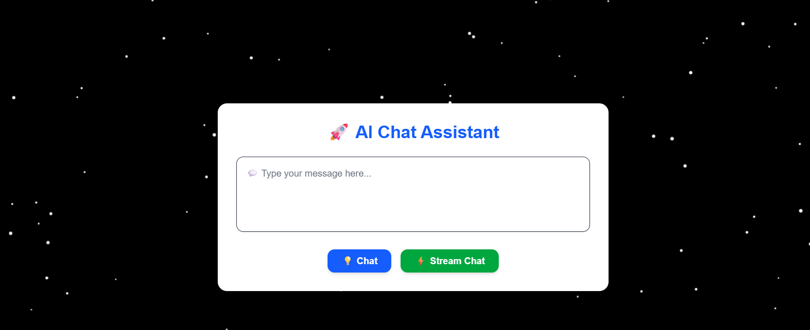

AetherChat 🚀

Interactive AI-Powered Chat Assistant built with Next.js 14 (App Router), TailwindCSS, and OpenAI API. Enjoy real-time streaming responses with a sleek animated background.

✨ Features

💬 Chat with an AI assistant powered by GPT models.

⚡ Real-time streaming responses using Server-Sent Events (SSE).

🎨 Modern UI with TailwindCSS and animated background effects (stars, blobs, lines).

🔒 Secure API key handling via .env.local.

🌐 Responsive and mobile-friendly design.

🚀 Smooth animations powered by Framer Motion or Canvas.

📂 Tech Stack

Frontend: Next.js, React.js, TailwindCSS

Backend / API: Next.js API Routes, OpenAI SDK

Animations: Framer Motion / HTML Canvas

Hosting: Vercel

💻 Getting Started

Clone the repository

git clone https://github.com/your-username/groq-chatbot.git
cd groq-chatbot

Install dependencies

npm install
# or
yarn install
# or
pnpm install

Add your environment variables
Create a .env.local file:

OPENAI_API_KEY=your_openai_api_key
GROQ_API_KEY=your_groq_api_key

Run the development server

npm run dev
# or
yarn dev
# or
pnpm dev

Open http://localhost:3000
 to view your app.

⚡ Scripts

npm run dev → Start development server

npm run build → Build production-ready app

npm run start → Start production server

🎨 Deployment

Easily deploy to Vercel:

Connect your GitHub repository.

Set the environment variables in Vercel.

Deploy your project.

📷 Screenshots / Demo

Add screenshots or GIFs of your app here to showcase the UI and animations.

📖 Learn More

Next.js Documentation

TailwindCSS Documentation

OpenAI API Documentation

🤝 Contributing

Feel free to submit issues, feature requests, or pull requests!